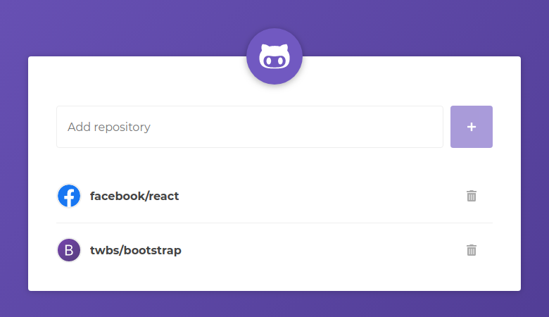
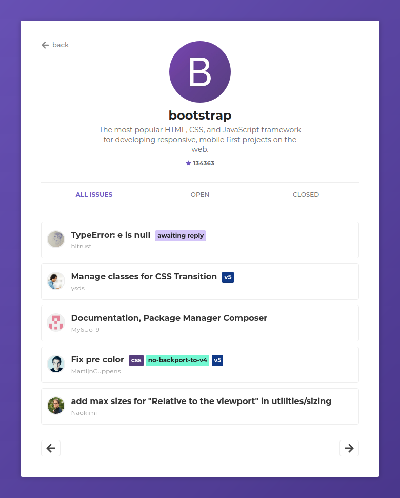

# GitHub Repos
:octocat: Add GitHub _repos_ and see its details and issues

### [Live Demo](https://luizbatanero-github-react.netlify.com/)




## Running Locally

```sh
npm install
npm start
```

Runs the app in the development mode.<br>
Open [http://localhost:3000](http://localhost:3000) to view it in the browser.
